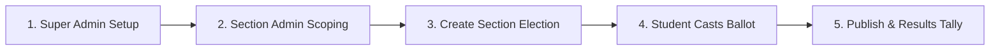

# College Voting System — Fresher & Campus Placement Interview Guide

> **Target Audience:** College Freshers, Final-Year Engineering Students, Junior Full-Stack Developers (0–1 Year Exp), and Viva Voce Examinations.  
> **Goal:** Help you speak confidently, explain your project architecture simply, and master interview questions on React, Node.js, Express, MySQL transactions, and Section-Based Role Access Control.

---

## Table of Contents
1. [Project Overview in Plain English](#1-project-overview-in-plain-english)
2. [Self-Introduction & Elevator Pitch (Spoken Scripts)](#2-self-introduction--elevator-pitch-spoken-scripts)
3. [Step-by-Step Live Project Demo Script](#3-step-by-step-live-project-demo-script)
4. [Architecture & Database Design (Simple & Clear)](#4-architecture--database-design-simple--clear)
5. [Core Technical Fundamentals (Viva & Fresher Questions)](#5-core-technical-fundamentals-viva--fresher-questions)
   - [A. React & Frontend Fundamentals](#a-react--frontend-fundamentals)
   - [B. Node.js & Express Fundamentals](#b-nodejs--express-fundamentals)
   - [C. Database & MySQL Fundamentals (ACID & Keys)](#c-database--mysql-fundamentals-acid--keys)
   - [D. Authentication, JWT & Security Fundamentals](#d-authentication-jwt--security-fundamentals)
   - [E. Section-Based Access Control & RBAC](#e-section-based-access-control--rbac)
6. [Code Walkthrough: "Show Me Your Code" Guide](#6-code-walkthrough-show-me-your-code-guide)
7. [Real Challenges You Faced & How You Solved Them (STAR Method)](#7-real-challenges-you-faced--how-you-solved-them-star-method)
8. [Top 20 Quick-Fire Interview & Viva Questions with Answers](#8-top-20-quick-fire-interview--viva-questions-with-answers)
9. [HTTP Status Codes Used in this Project](#9-http-status-codes-used-in-this-project)
10. [Fresher Interview Tips: Do's and Don'ts](#10-fresher-interview-tips-dos-and-donts)

---

## 1. Project Overview in Plain English

### What is this project?
The **College Voting System** is a secure, role-based, multi-tier web application designed to conduct institutional student council elections with high integrity. Instead of error-prone paper ballots or unverified Google Forms, it enforces a strict academic hierarchy:

$$\text{College} \longrightarrow \text{Department} \longrightarrow \text{Academic Year} \longrightarrow \text{Section}$$

It provides three dedicated user experiences:
- **Super Admin Portal:** College-wide authority. Manages departments (CSE, ECE, IT, etc.), academic years (1st–4th Year), sections (A, B, C), and assigns faculty/staff Admins to specific sections.
- **Section Admin Portal:** Strictly restricted to their assigned **Department + Year + Section** (e.g., `CSE -> 1st Year -> Section A`). Admins can only create and manage elections, contest positions (Class Representative, Cultural Secretary), candidates, student voter rolls, and view results belonging to their exact assigned section.
- **Student Voting Portal:** Allows verified students to log in, review manifestos, cast a secure atomic ballot across multiple positions, and view real-time tally charts once results are officially published.

### Tech Stack Summary
| Layer | Technology | Why We Used It |
| :--- | :--- | :--- |
| **Frontend** | React 19, Vite, Tailwind CSS, Lucide Icons | Component-based UI, reactive state management, clean responsive design |
| **Routing** | React Router v7 | Client-side routing with role-based `<ProtectedRoute>` guards |
| **Backend** | Node.js, Express.js | High-concurrency, non-blocking asynchronous RESTful API server |
| **Database** | MySQL 8 (`mysql2/promise`) | Relational data integrity, foreign key constraints, and ACID transactions |
| **Auth & Security** | JWT, `bcryptjs` | Stateless token authentication, salted password hashing, DB-level scope checks |
| **Email Service** | Brevo (Transactional API) | Automated temporary credential delivery and 5-minute expiry OTP for password reset |

---

## 2. Self-Introduction & Elevator Pitch (Spoken Scripts)

### Option A: 30-Second Quick Pitch (When asked: *"Briefly summarize your project"*)
> *"For my major project, I built a full-stack **College Voting System** using **React, Node.js, Express, and MySQL**.  
> It solves two major challenges in student council elections: **double-voting** and **unauthorized cross-section election tampering**.  
> The system implements a 3-tier academic hierarchy — Department, Year, and Section.  
> Two features I'm most proud of are:
> 1. Our **atomic voting transaction** in MySQL with compound unique constraints that guarantees zero double-voting.
> 2. Our **backend-enforced section access control**, where an Admin assigned to CSE 1st Year Section A is strictly blocked at the database query level from viewing, editing, or deleting elections from Section B or other departments."*

---

### Option B: 90-Second Structured Pitch (When asked: *"Tell me about your final year project"*)
> *"In our college, elections were conducted using paper ballots and Google Forms. This led to manual counting errors, lack of ballot secrecy, double voting, and students voting for sections they didn't belong to.  
> 
> To solve this, I architected a full-stack election platform with three key technical pillars:
> 
> 1. **Strict Section-Based Access Control:** Super Admins have college-wide access. Normal Admins are assigned to a specific Department, Year, and Section (e.g., CSE $\rightarrow$ 1st Year $\rightarrow$ Section 1). The Express backend validates this scope against the MySQL database on every single request. Even if an admin manually manipulates the URL or sends an API request targeting another section's election, the server rejects it with HTTP `403 Forbidden`.
> 2. **Double-Voting Prevention with ACID Transactions:** We combined frontend button locking with a compound unique key on `(election_id, position_id, student_id)`. Vote submission is wrapped in a dedicated MySQL transaction (`START TRANSACTION`, `COMMIT`, `ROLLBACK`) so if a vote fails halfway through a multi-position ballot, the entire transaction rolls back cleanly.
> 3. **Secure Authentication & Onboarding:** Passwords are encrypted with `bcryptjs`. We use JWT tokens for stateless authorization and integrated Brevo's Transactional Email API for automatic credential delivery and 5-minute expiry OTPs for password resets.
> 
> The project eliminated counting delays, reduced ballot processing time to milliseconds, and guarantees tamper-proof election outcomes."*

---

## 3. Step-by-Step Live Project Demo Script

If an interviewer asks: *"Can you share your screen and give me a quick live demo?"*, follow this 5-step flow:



1. **Step 1: Super Admin Portal (`/login`)**
   - Log in as Super Admin (`superadmin@college.com`).
   - Show the academic hierarchy: Departments (CSE, ECE, IT) $\rightarrow$ Academic Years (1st–4th Year) $\rightarrow$ Sections (A, B, C).
   - Show the Admin Management table: point out how each Admin is linked to a specific Department, Year, and Section.
2. **Step 2: Section Admin Login & Scope Verification**
   - Log in as `cse.admin@college.com` (assigned to CSE $\rightarrow$ 1st Year $\rightarrow$ Section A).
   - Point out the **Assigned Section Badge** at the top of the Election Management page:  
     `Your Assigned Section: CSE • 1st Year • Section A`.
   - Show that this Admin **only sees elections belonging to CSE 1st Year Section A**. Elections from Section B or 2nd Year are not displayed.
3. **Step 3: Creating a Section-Scoped Election & Student**
   - Click "Create Election". Show the read-only **Election Scope** card. The Admin cannot choose arbitrary departments or sections — the backend automatically binds the election to their assigned section.
   - Show the Student Management page: show how creating a student automatically registers them into `CSE -> 1st Year -> Section A`.
4. **Step 4: Student Login & Single-Ballot Voting**
   - Log in as an eligible student in Section A.
   - The student sees only their active section election.
   - Click "Vote Now", select candidates for each position (e.g., President, CR), review the ballot summary, and submit.
   - Show the immediate badge change from "Active" to **"Voted"**.
   - **Key Demonstration:** Try clicking the voting button again or refreshing $\rightarrow$ prove that the system blocks double-voting.
5. **Step 5: Publish Results & Results Chart**
   - Switch back to Admin $\rightarrow$ Close the election and click "Publish Results".
   - Switch back to Student or Admin $\rightarrow$ Open the Results page.
   - Show the dynamic bar charts displaying votes per candidate, percentages, and total turnout.

---

## 4. Architecture & Database Design (Simple & Clear)

### High-Level Architecture Diagram
```
[ React 19 Frontend (Vite) ]
          │
     HTTP REST API (JSON + Authorization: Bearer <JWT>)
          ▼
[ Express.js Backend Server ]
    ├── authMiddleware (Verifies JWT signature & expiration)
    ├── roleMiddleware (SUPER_ADMIN / ADMIN / STUDENT)
    ├── adminScopeMiddleware (Fetches DB section assignment & verifies election scope)
    └── Controllers (electionController, voteController, studentController)
          │                                  │
          ▼                                  ▼
  [ MySQL 8 Database ]                [ Brevo Email API ]
   - users, admins, students           - Welcome Credentials
   - departments, years, sections      - 5-Minute Expiry OTP
   - elections, positions, candidates
   - eligible_voters, votes (ACID)
```

### Complete Database Schema (Explain in 90 Seconds)

1. **`users`**: Central authentication table (`id`, `email`, `password_hash`, `role`, `status`, `must_change_password`).
2. **`departments`**, **`years`**, **`sections`**: Models the 3-tier academic hierarchy:
   - `departments`: `(id, name, code)`
   - `years`: `(id, department_id, name)` $\rightarrow$ Foreign Key to `departments(id) ON DELETE CASCADE`.
   - `sections`: `(id, year_id, name)` $\rightarrow$ Foreign Key to `years(id) ON DELETE CASCADE`.
3. **`admins`**: Stores faculty/staff admin profiles (`id`, `user_id`, `full_name`, `department_id`, `year_id`, `section_id`).
4. **`students`**: Stores student profiles (`id`, `user_id`, `student_id`, `full_name`, `department_id`, `year_id`, `section_id`, `phone`, `status`).
5. **`elections`**: Holds election information (`id`, `title`, `description`, `start_date`, `end_date`, `status`, `department_id`, `year_id`, `section_id`, `created_by`).
   - `department_id`, `year_id`, `section_id` explicitly bind the election to a section.
   - Super Admin college-wide elections have `NULL` for these fields.
6. **`positions`**: Contested roles within an election (`id`, `election_id`, `name`, `description`).
7. **`candidates`**: Students contesting a position (`id`, `election_id`, `position_id`, `student_id`, `manifesto`, `photo_url`, `status`).
8. **`eligible_voters`**: Registered voter roll (`id`, `election_id`, `student_id`).
   - `UNIQUE KEY (election_id, student_id)` ensures a student is only enrolled once per election.
9. **`votes`**: Cast ballots (`id`, `election_id`, `position_id`, `candidate_id`, `student_id`, `voted_at`).
   - **Crucial Rule:** `UNIQUE KEY (election_id, position_id, student_id)` — Physically prevents double-voting at the database engine level.
10. **`otp_verifications`**: Password reset tokens (`id`, `user_id`, `otp_code`, `purpose`, `expires_at`, `verified`).

---

## 5. Core Technical Fundamentals (Viva & Fresher Questions)

---

### A. React & Frontend Fundamentals

#### Q1: "What is React, and why did you choose it over vanilla HTML/JavaScript?"
**Fresher Answer:**
> *"React is a component-based JavaScript library for building fast user interfaces. I chose React because:
> 1. **Reusable Components:** UI elements like `StatCard`, `Modal`, `Alert`, and `ElectionCard` were created once and used across Admin and Student views.
> 2. **Declarative State Management:** When a student casts a vote, React updates the local state and flips the badge to 'Voted' without reloading the whole page.
> 3. **Single Page Application (SPA):** Using React Router v7, navigation between Dashboard, Elections, and Results is instant without page reloads."*

#### Q2: "What is the difference between `Props` and `State` in React?"
**Fresher Answer:**
> - *"**State** is internal data managed within the component that can change over time (e.g., `searchQuery`, `isCreateModalOpen`, or `positionsList`). When state changes, the component re-renders.
> - **Props** (properties) are read-only inputs passed from a parent component down to a child component (e.g., `<StatCard title="Total Elections" value={stats.total} icon={<Vote />} />`)."*

#### Q3: "Which React Hooks did you use in this project?"
**Fresher Answer:**
> *"I used four primary hooks:
> 1. `useState`: For local component state, like form inputs (`title`, `startDate`), modal open/close flags, and filter dropdowns.
> 2. `useEffect`: For lifecycle actions, like fetching admin profile and elections from the API on initial component mount.
> 3. `useCallback` & `useMemo`: For performance optimization — memoizing data-fetch functions (`loadData`) and derived calculations (`studentStats`, `electionStats`) to prevent unnecessary re-computations on re-render.
> 4. `useContext`: We built an `AuthContext` with a custom `useAuth()` hook to share user authentication status, role, and JWT token across the entire application."*

---

### B. Node.js & Express Fundamentals

#### Q4: "What is Express Middleware? Where did you use it?"
**Fresher Answer:**
> *"Middleware is a function in Express that executes in the request-response cycle before reaching the final route handler. It has access to `req`, `res`, and `next()`.  
> In our project, we used:
> 1. `express.json()`: Parses incoming JSON request payloads.
> 2. `cors()`: Handles cross-origin requests from the React frontend.
> 3. `authenticateToken`: Reads `Authorization: Bearer <token>`, verifies the JWT signature, and attaches `req.user`.
> 4. `authorizeRoles`: Restricts routes based on role (e.g., `authorizeRoles("SUPER_ADMIN", "ADMIN")`)."*

#### Q5: "What is the difference between `req.body`, `req.params`, and `req.query`?"
**Fresher Answer:**
> - `req.body`: Contains data sent in POST/PUT/PATCH requests (e.g., `{ title, startDate }` when creating an election).
> - `req.params`: Route parameters in the URL path (e.g., in `/api/elections/:id`, `req.params.id` gives the election ID).
> - `req.query`: Query string parameters after `?` (e.g., in `/api/students?status=ACTIVE`, `req.query.status` is `'ACTIVE'`)."

---

### C. Database & MySQL Fundamentals (ACID & Keys)

#### Q6: "What are ACID properties, and how did you implement them in this project?"
*(⚠️ This is the #1 database question in technical interviews!)*  
**Fresher Answer:**
> *"ACID stands for:
> - **Atomicity (All or Nothing):** In student voting, a ballot can contain multiple positions (e.g., President and Secretary). We wrap the vote submission in a MySQL transaction:
>   ```javascript
>   const connection = await pool.getConnection();
>   await connection.beginTransaction();
>   try {
>     // validate voter eligibility
>     // insert vote for position 1
>     // insert vote for position 2
>     await connection.commit();
>   } catch (error) {
>     await connection.rollback();
>   } finally {
>     connection.release();
>   }
>   ```
>   If inserting position 2 fails, `rollback()` undoes position 1. A student never ends up partially voted.
> - **Consistency:** Foreign key constraints (`fk_election_department`, `fk_vote_candidate`) prevent orphan records.
> - **Isolation:** MySQL transaction isolation ensures concurrent ballots from 100 students do not interfere with each other.
> - **Durability:** Once committed, votes are written to MySQL redo logs and disk, surviving server restarts."*

#### Q7: "Why did you use `LEFT JOIN` instead of `INNER JOIN` for election results?"
**Fresher Answer:**
> *"When aggregating candidate vote counts:
> ```sql
> SELECT c.id, s.full_name, COUNT(v.id) AS vote_count
> FROM candidates c
> JOIN students s ON c.student_id = s.id
> LEFT JOIN votes v ON v.candidate_id = c.id
> WHERE c.election_id = ?
> GROUP BY c.id;
> ```
> If a candidate has **0 votes**, an `INNER JOIN` would drop them from the query output entirely. A `LEFT JOIN` retains the candidate row and returns `vote_count = 0`, ensuring accurate and complete results charts."*

---

### D. Authentication, JWT & Security Fundamentals

#### Q8: "What is JWT, and what does it contain in this project?"
**Fresher Answer:**
> *"JSON Web Token (JWT) is a stateless, URL-safe authentication token. It has 3 parts: `Header.Payload.Signature`.
> - **Header:** Algorithm (`HS256`).
> - **Payload:** `userId`, `email`, and `role`. We specifically **do not** store sensitive section data or passwords in the payload. Section assignment is always verified dynamically from the database to reflect immediate updates.
> - **Signature:** `HMAC-SHA256(header + payload, JWT_SECRET)`.
> 
> When the user logs in, the server returns the signed JWT. The frontend stores it in `localStorage` and includes it in the `Authorization: Bearer <token>` header for subsequent requests."*

#### Q9: "Why did you use `bcryptjs` for password hashing?"
**Fresher Answer:**
> *"Hashing is a one-way mathematical function — it cannot be decrypted.  
> `bcryptjs` incorporates a **salt** (random string) and a configurable cost factor (`bcrypt.hash(password, 10)`). This protects against pre-computed dictionary attacks (rainbow tables) and brute-force cracking. Even if two users have the same password, their hashes in the database will be completely different."*

---

### E. Section-Based Access Control & RBAC

#### Q10: "Explain the difference between RBAC and your Section-Based Access Control."
*(⚠️ Core concept of this project!)*  
**Fresher Answer:**
> *"Standard Role-Based Access Control (RBAC) only checks if a user is an `ADMIN` or `STUDENT`. Under basic RBAC, any Admin could view or modify any election in the entire college.  
> 
> Our system extends RBAC with **Attribute-Based Section Scoping**:
> - `SUPER_ADMIN`: Has college-wide permissions across all departments, years, and sections.
> - `ADMIN`: Role is `ADMIN`, but their scope is strictly bound to `(department_id, year_id, section_id)`.
>   When Admin A (`CSE -> 1st Year -> Section 1`) attempts an action on Election 24 (`CSE -> 1st Year -> Section 2`), the backend checks:
>   ```javascript
>   if (admin.department_id !== election.department_id ||
>       admin.year_id !== election.year_id ||
>       admin.section_id !== election.section_id) {
>     return res.status(403).json({
>       message: "You are not authorized to access this election. This election does not belong to your assigned section."
>     });
>   }
>   ```
>   This enforcement happens at the backend controller and database query level — not just hidden buttons in React."*

---

## 6. Code Walkthrough: "Show Me Your Code" Guide

If the interviewer asks: *"Open your code editor and show me how feature X is implemented"*, open these exact files and lines:

### 1. Section Access Control Helper
- **File:** [backend/middleware/adminScopeMiddleware.js](file:///c:/Users/sivam/OneDrive/Documents/Desktop/clg_voting/backend/middleware/adminScopeMiddleware.js)
- **What to explain:**
  1. `getAdminScope(userId)`: Queries the `admins` table directly from MySQL to get the Admin's latest section assignment.
  2. `checkAdminElectionScope(adminScope, election)`: Compares `department_id`, `year_id`, and `section_id`. Returns `false` if any attribute differs.
  3. `checkAdminStudentScope(adminScope, student)`: Prevents an admin from adding students or eligible voters outside their section.

### 2. Scoped Election Queries & Enforcement
- **File:** [backend/controllers/electionController.js](file:///c:/Users/sivam/OneDrive/Documents/Desktop/clg_voting/backend/controllers/electionController.js)
- **What to explain:**
  1. `getAllElections`: For `ADMIN`, queries MySQL with `WHERE department_id = ? AND year_id = ? AND section_id = ?`. For `STUDENT`, queries only elections where the student is registered in `eligible_voters`.
  2. `createElectionController`: Does **not** trust client input for department or section. Automatically overrides:
     `departmentId = adminScope.department_id`, `yearId = adminScope.year_id`, `sectionId = adminScope.section_id`.
  3. `getElectionById`, `updateElectionController`, `deleteElectionController`, `changeElectionStatus`: Rejects mismatched sections with `403 Forbidden`.

### 3. Atomic Voting Transaction
- **File:** [backend/controllers/voteController.js](file:///c:/Users/sivam/OneDrive/Documents/Desktop/clg_voting/backend/controllers/voteController.js) (Function: `submitVotes`)
- **What to explain:**
  1. `const connection = await pool.getConnection();` $\rightarrow$ Dedicated pool connection.
  2. `await connection.beginTransaction();` $\rightarrow$ Start atomic transaction.
  3. `voteModel.isEligibleVoter()` $\rightarrow$ Verify voter eligibility.
  4. Loop over votes array $\rightarrow$ Insert vote records.
  5. `await connection.commit();` $\rightarrow$ Commit all votes together.
  6. `catch (error)` $\rightarrow$ `await connection.rollback();` $\rightarrow$ Clean rollback if any position fails.

### 4. Direct URL Protection & Scope Badges in React
- **File:** [frontend/src/pages/admin/ElectionManagement.jsx](file:///c:/Users/sivam/OneDrive/Documents/Desktop/clg_voting/frontend/src/pages/admin/ElectionManagement.jsx)
- **What to explain:**
  1. Header Section: Displays the assigned section badge card: `Your Assigned Section: CSE • 1st Year • Section A`.
  2. `handleOpenDetails`: Before rendering election details, fetches `getElectionById(election.id)`. If the backend returns `403`, catches the error, displays the unauthorized toast, and closes the modal without exposing sensitive data.
  3. Create Election Modal: Displays read-only section scope card, eliminating arbitrary selection dropdowns.

---

## 7. Real Challenges You Faced & How You Solved Them (STAR Method)

When an interviewer asks: *"Tell me about a difficult technical challenge you encountered while building this project and how you resolved it"*, pick one of these stories:

---

### Challenge 1: Direct URL & API Manipulation Security in Multi-Tenant Sections
- **Situation:** While testing the Admin portal, we realized that an Admin assigned to `CSE 1st Year Section 1` could open DevTools or change the URL to inspect an election belonging to `Section 2`. Even if we hid the edit button in React, an attacker could send a `PUT /api/elections/24` or `POST /api/elections/24/close` request directly using Postman.
- **Task:** Enforce strict section authorization at the backend API and database layer so that unauthorized Admin requests are rejected regardless of client-side tampering.
- **Action:**
  1. Added `department_id`, `year_id`, and `section_id` foreign keys to the `elections` table.
  2. Built `adminScopeMiddleware.js` with `getAdminScope()` that fetches the Admin's true assignment from MySQL on every request (never trusting client input).
  3. Integrated section scope verification into every controller: `getElectionById`, `updateElection`, `deleteElection`, `changeElectionStatus`, `positions`, `candidates`, `eligible_voters`, and `results`.
  4. Configured the SQL queries in `getAllElections` to filter by the Admin's section parameters at the query level.
- **Result:** Complete protection against URL tampering and API manipulation. Any unauthorized access returns HTTP `403 Forbidden` (`UNAUTHORIZED_ELECTION_MESSAGE`). We validated this with an automated 10-test audit suite where all 10 tests passed.

---

### Challenge 2: The Double-Voting Race Condition
- **Situation:** During multi-user load testing, if a student rapidly double-clicked "Submit Ballot" or had poor network connectivity, two parallel HTTP POST requests hit the Express server simultaneously. If both requests checked `hasVoted` before either had inserted the vote, two ballots were recorded for the same student.
- **Task:** Guarantee that no student can ever cast more than one ballot for a position under any circumstance.
- **Action:**
  1. **Frontend:** Added button-level locking and loading states immediately upon first click.
  2. **Database Engine:** Added a MySQL compound unique constraint:  
     `UNIQUE KEY unique_vote (election_id, position_id, student_id)`.
  3. **Backend Transaction:** Wrapped ballot insertion inside a MySQL transaction (`START TRANSACTION`, `COMMIT`, `ROLLBACK`) and caught `ER_DUP_ENTRY` (MySQL error 1062) to return a clean `409 Conflict`.
- **Result:** Absolute double-voting prevention enforced at the database storage engine layer.

---

### Challenge 3: Maintaining Database Integrity without Dropping Existing Tables
- **Situation:** Our production database already had active elections, candidates, and votes created under an earlier schema without section columns. We needed to add `department_id`, `year_id`, and `section_id` without dropping tables, resetting the database, or corrupting existing records.
- **Task:** Execute an idempotent, zero-downtime database migration that preserves all existing voter records.
- **Action:**
  1. Created an automated migration script (`migrateElectionsScope.js`) that checks `SHOW COLUMNS FROM elections LIKE 'department_id'` before executing `ALTER TABLE`.
  2. Applied `ADD CONSTRAINT fk_election_department FOREIGN KEY ... ON DELETE SET NULL` for referential integrity.
  3. Ran a backfill query joining `elections` with `admins` via `created_by = a.user_id` to populate historical section data. Existing Super Admin college-wide elections remained safely as `NULL`.
- **Result:** Successfully migrated the database with zero data loss, preserving all user accounts and historical vote tallies.

---

## 8. Top 20 Quick-Fire Interview & Viva Questions with Answers

| # | Question | Short & Crisp Fresher Answer |
|---|---|---|
| **1** | What is CORS? | Cross-Origin Resource Sharing. A browser security rule that prevents frontend on `localhost:5173` from calling backend on `localhost:5000` unless backend enables `cors()`. |
| **2** | What is a RESTful API? | An API architectural style that uses standard HTTP verbs (`GET`, `POST`, `PUT`, `PATCH`, `DELETE`) with stateless communication. |
| **3** | What is the difference between `PUT` and `PATCH`? | `PUT` replaces the entire resource representation, while `PATCH` applies partial updates (e.g., updating only `status`). |
| **4** | What is connection pooling in MySQL? | Maintaining a pool of reusable database connections rather than opening and closing a TCP socket on every single query, boosting throughput. |
| **5** | What is the purpose of the `.env` file? | Storing sensitive credentials (DB passwords, `JWT_SECRET`, Brevo API keys) securely outside version control (`.gitignore`). |
| **6** | What happens if a JWT token expires? | `jwt.verify()` throws a `TokenExpiredError`. The backend returns `401 Unauthorized`, prompting the frontend to redirect to `/login`. |
| **7** | What is SQL Injection and how did you prevent it? | An attack where malicious SQL is injected into queries. We prevented it 100% by using parameterized prepared statements (`pool.query("SELECT ... WHERE id = ?", [id])`). |
| **8** | What is the difference between `==` and `===` in JavaScript? | `==` checks value with type coercion (e.g., `'1' == 1` is true), while `===` checks both value and type without coercion (e.g., `'1' === 1` is false). |
| **9** | What is a foreign key with `ON DELETE CASCADE`? | When a parent row is deleted (e.g., an Election), MySQL automatically deletes all child rows (Positions, Candidates, Votes) to prevent orphan data. |
| **10** | What is the role of `must_change_password` in your users table? | When an Admin creates a student, a temporary password is generated. On first login, `must_change_password = true` forces the student to set a private password before accessing the ballot. |
| **11** | How does your Brevo email integration work? | When new accounts or OTPs are generated, Express calls Brevo's Transactional Email REST API over HTTPS to deliver emails. |
| **12** | How did you handle 403 Forbidden errors in React? | When an API response returns 403, Axios intercepts the error, extracts `response.data.message`, and displays a red toast notification. |
| **13** | What is an index in MySQL? | A B-Tree data structure that enables $O(\log N)$ search times instead of full table scans. We indexed `(election_id, position_id, student_id)`. |
| **14** | What is `useMemo` in React? | A hook that caches the result of an expensive calculation between renders (e.g., calculating vote percentages from candidate arrays). |
| **15** | What is `useCallback` in React? | A hook that caches a function definition between renders so child components don't re-render unnecessarily. |
| **16** | What is the difference between Authentication and Authorization? | **Authentication** confirms *who you are* (Login with JWT). **Authorization** confirms *what you are allowed to do* (Admin scope checking). |
| **17** | Why did you choose Vite instead of Create React App (CRA)? | Vite uses native ES modules during development, resulting in sub-second server startup and instant Hot Module Replacement (HMR). |
| **18** | What is an atomic transaction? | A database operation where multiple queries execute as a single indivisible unit — either all succeed (`COMMIT`) or all fail (`ROLLBACK`). |
| **19** | How do you prevent an Admin from altering another section's election status? | The endpoint handler queries the election from MySQL and verifies `checkAdminElectionScope(adminScope, election)` before executing any status update. |
| **20** | What is the difference between Synchronous and Asynchronous JavaScript? | Synchronous code blocks execution until the operation completes. Asynchronous code (`async/await`, Promises) allows Node.js to handle other requests while waiting for I/O operations. |

---

## 9. HTTP Status Codes Used in this Project

| Code | Name | Where We Used It |
|---|---|---|
| **`200 OK`** | Success | Fetching election lists, viewing results, verifying profiles. |
| **`201 Created`** | Created | Creating an election, adding a candidate, creating a student account, casting a vote. |
| **`400 Bad Request`** | Client Error | Missing required fields, invalid date range (`end <= start`), or voting after election has closed. |
| **`401 Unauthorized`** | Auth Missing | No `Authorization: Bearer` header, invalid JWT token, or token expired. |
| **`403 Forbidden`** | Permission Denied | **Section Access Control Violation** (Admin attempting to access another section's election, positions, candidates, or students), or Student trying to view draft elections. |
| **`404 Not Found`** | Not Found | Election ID, candidate ID, or student ID does not exist in the database. |
| **`409 Conflict`** | Duplicate / Conflict | Student attempting to vote twice for the same position (`ER_DUP_ENTRY`), or email already registered. |
| **`500 Internal Error`** | Server Failure | Database connection outage or unexpected server runtime exception. |

---

## 10. Fresher Interview Tips: Do's and Don'ts

### ❌ Red Flags (What NOT to Do)
1. **Never say:** *"I don't know, I just copied this code from a tutorial or ChatGPT."*  
   $\rightarrow$ **Say instead:** *"I researched standard industry patterns for role-based multi-tenant authorization and implemented section scoping using database verification."*
2. **Don't use buzzwords you cannot defend:** If you say *"microservices"* or *"blockchain"*, the interviewer will grill you on consensus algorithms. Speak proudly about your **monolithic Express + MySQL architecture** — that is what real production systems often use!
3. **Don't guess blindly:** If asked something you don't know (e.g., *"How would you handle Redis caching for results?"*), say:  
   *"I haven't implemented Redis in this version, but I understand it would cache the aggregated results in memory so the database isn't queried on every reload."*

###  Green Flags (What Impresses Interviewers)
1. **Explain the 'Why' behind technical decisions:**
   - *"I chose MySQL over MongoDB because elections require strict relational consistency, foreign key cascades, and atomic transactions to prevent double-voting."*
   - *"I implemented section scoping at the backend query level rather than just in React because frontend security can easily be bypassed using tools like Postman or Curl."*
2. **Emphasize Data Integrity & Failure Modes:** Mentioning `connection.rollback()`, `try/catch`, `ER_DUP_ENTRY`, and HTTP `403 Forbidden` shows mature engineering thinking.
3. **Speak with Confidence and Energy:** Practice your 90-second pitch out loud. You built an impressive, production-grade system — be proud of it!
